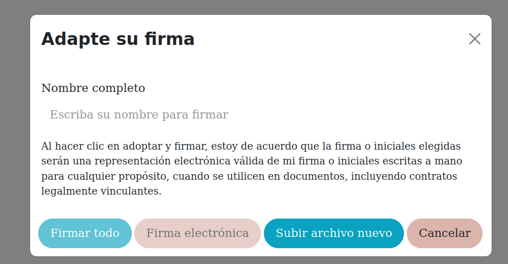

# 📄 Sign Ext Options

**Sign Ext Options** es un módulo desarrollado para **Odoo 18** que extiende el comportamiento del wizard de firma electrónica del módulo nativo `sign`.

## 🚀 Características

- ✅ Añade un cuarto botón al wizard de firma llamado **"Subir archivo nuevo"**.
- 📁 Este botón permite a los firmantes **cargar archivos locales**, mejorando la flexibilidad del proceso de firma.
- 🖥️ Compatible con las vistas del **frontend público** y también con las vistas backend del módulo `sign`.

## 🖼️ Vista del Wizard

El botón añadido se muestra junto a los botones estándar del wizard de firma:

> El botón **"Subir archivo nuevo"** permite al firmante **adjuntar un nuevo archivo directamente desde su equipo** antes de proceder con la firma.

## ⚙️ Instalación

1. Copia el módulo `sign_ext_module` en tu carpeta de `addons`.
2. Asegúrate de que los módulos `sign` y `web` estén instalados en tu instancia de Odoo.
3. Reinicia el servidor de Odoo.
4. Actualiza la lista de aplicaciones.
5. Busca **Sign Ext Options** en el backend de Odoo y haz clic en **Instalar**.

> ⚠️ Si también usas vistas OWL personalizadas, asegúrate de que el archivo `sign_patch.js` contenga los *patches* necesarios para añadir el botón en `SignNameAndSignatureDialog`.

## 🧩 Dependencias

Este módulo requiere que estén instalados:

- `sign`
- `web`

## 🧑‍💻 Autor

Desarrollado por **Breithner Aquituari**  

📜 Licencia: LGPL-3

